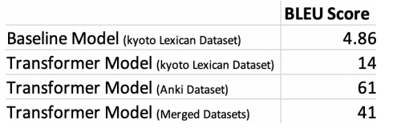
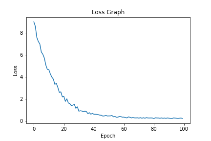
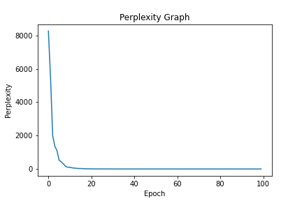

# Machine_Translation
Translation of Japanese to English language. 

## Project Topic: Neural Machine Translation

## A. Project Team members

1. Sai Bharadwaj Reddy Arrabelly - 801166672
2. Monesa Thoguluva Janardhanan - 801167556
3. Prashanth Minkuri - 801166901

## B. Project Topic Introduction
We are planning to implement a Neural Machine Translation using the Transformer Model for
translation of Japanese sentences to English. As of January 2020, Transformers are the dominant
architecture in NLP and are used to achieve state-of-the-art results for many tasks and it appears
as if they will be for the near future.
Recurrent neural networks are very slow to train and without LSTM the model is not very
accurate. But with LSTM, the model makes it much slower to train.We made the Seq2Seq model
as our baseline model but the performance was very low. To enhance the performance we are
using the Transformer model for our project.Attention is all you need: paper deals with English
to German and English to French and have shown the BLEU score of 28.1 and 41.0 respectively.
For Japanese to English we have implemented the state of art model and achieved a BLEU score
of 41.0.

# Approaches

We used Spacy for Tokenizing the Data. Our Implementation is being Done is Pytorch due to which TorchText Fields were also used in preprocessing. Torch Text fields make it easy to make Dataloaders of the data for the models to train on.

First we implemented a Seq2seq which uses Encoder - Decoder. Both Encoder and Decoder use RNN. Encoder encodes the input sentence into a single vector, Decoder takes in that vector and outputs the sentence. After Viewing the Results we moved on to Implement the Transformer Model. 

Our Approach is to Implement the Transformer Architecture which is introduced in the paper
“Attention Is All You Need”. As the title says the Transformer Model uses Attention which is a mechanism of which looks at parts of input and decides at each step on which part of the input is important. 

Transformer architecture also has Encoder and Decoder, but “Multi Head Attention” is Used at Encoder and “Multi-Headed Attention” , “Masked Multi-headed Attention” are used in Decoder.

For encoder as the paper suggests first the tokens are passed to an Input embedding layer. Next a Positional Embedding layer is used to help our model for the sequence by injecting some information about the relative or absolute position of the tokens. Next we have used Multihead attention means many attention vectors will be created for each word and the Wz weight will choose which attention vector to take. (Multiple attention vector for one word) And the rest of the things in the model are normal like Feed Forward Neural Network and Normalization.

We are using the BLEU metric in our model as this is the basic metric which provides quick and
quality assessment of our translation. It measures direct word-to-word similarity that provides first hand analysis of the quality of our translation. BLEU has frequently been reported as correlating well with human judgement. Another metric we are using our project is Perplexity. 

In natural language processing, perplexity is a way of evaluating language models. A language model is a probability distribution over entire sentences or texts.

## Results

As a first step we used a Japanese English corpus from the following link for our model.
https://www.kaggle.com/team-ai/japaneseenglish-bilingual-corpus

This dataset mainly deals about traditional Japanese culture, religion, and history. As we went through the dataset it didn't have any daily life conversation or normal words that Japanese
people use frequently. It was all about government offices, festivals etc. When we built our baseline model (we used the seq2seq model as our baseline) and ran this dataset we achieved
a very low BLEU score of 4.86 and the Perplexity score was 64.835. When we built a
transformer model and trained with this dataset, it gave us a BLEU score of 14.This made us look into more datasets and we felt if we have huge data for training the model will predict
well. So we found another dataset from the following link
https://www.manythings.org/anki/

This is a normal daily life conversation of Japanese and we trained our model with this dataset.
To our surprise we got a BLEU score of 61.0 and the next step was to merge our dataset and
predict the BLEU score. This gave us a BLEU score of 41.49 and the Perplexity score was 1.2

Above graphs suggested how loss and perplexity are getting changed during the training of the transformer model.

## Summary

The main aim of our project is to build a Neural Machine Translation model by using a
Transformer model to translate Japanese sentences to English sentences.
We have followed the same approach followed in the following paper

"Attention is all you need"
https://papers.nips.cc/paper/2017/file/3f5ee243547dee91fbd053c1c4a845aa-Paper.pdf
This paper has built a transformer model for English to German and English to French and has acquired about 28.4 and 41.0 BLEU score respectively.
We have built the same Transformer model by following the paper for Japanese to English and have succeeded in achieving the state of the art BLEU score.
First we implemented a Seq2seq which uses Encoder - Decoder. Both Encoder and Decoder use RNN. Encoder encodes the input sentence into a single vector, Decoder takes in that vector and outputs the sentence.
The dataset that we have used for the Seq2Seq model was taken from the following link.

https://www.kaggle.com/team-ai/japaneseenglish-bilingual-corpus/

This dataset mainly deals about traditional Japanese culture, religion, and history. As we went through the dataset it didn't have any daily life conversation or normal words that Japanese people use frequently. It was all about government offices, festivals etc. When we built our baseline model and ran this dataset we achieved a very low BLEU score of 4.86. This made us look into more datasets and we felt if we have huge data for training the model will predict well.

So we found another dataset from the following link
https://www.manythings.org/anki/

The next step was implementing the transformer model. We merged both the datasets into 1
and we trained the model with 68674 records. For the Transformer model we have implemented the encoders and the decoders exactly as mentioned in the “Attention is all you need” paper. We have achieved a BLEU score of 41.49 with our model. Some observations we have seen in our
results are 

* Our model translates sentences correctly only where a proper subject or a proper end of
sentence (.) is present.
* Our model is fairly okay when it needs to translate sentences about Japanese culture, religion,
and history. We believe that a huge dataset is needed for training in order to translate it correctly.
* Our model translates pretty decently when it comes to daily life conversations in Japanese.

